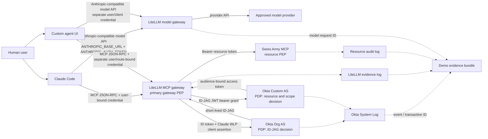
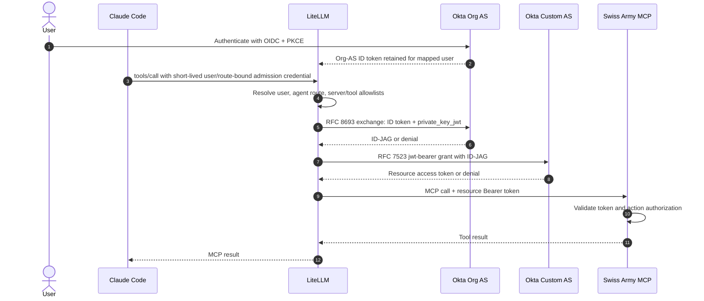

# Architecture

## Target outcome

Okta owns the governed identities, Resource Connection, scope policy, token issuance, and lifecycle decision. LiteLLM admits the client, exposes only its configured MCP surface, requests the Okta credential, and forwards only on success. The Swiss Army MCP is the final resource enforcement boundary and validates the Okta token on every protected call.

Calling LiteLLM the primary PEP does not make the resource optional. A bearer token can bypass a gateway if the resource accepts it without validating issuer, audience, expiry, scopes, and actor lineage.

## MVP topology: two independent Claude traffic planes

Claude Code does not send model inference through MCP. The demo must configure and observe both planes; proving the MCP route says nothing about model routing, and proving model routing says nothing about MCP authorization.

The model and MCP endpoints may share a LiteLLM deployment, but they use separate credentials, routes, authorization decisions, failure domains, and telemetry. Model-provider failure must not weaken MCP authorization. MCP/Okta failure may leave model-only use available, but Claude must not silently substitute a direct MCP endpoint.

## Identity model

Keep four identifiers distinct:

| Identity | Meaning | MVP representation |
|---|---|---|
| Human | Employee whose delegated session/permissions are used | Org-AS ID-token `sub` |
| Logical agent | Customer-governed deployment identity attributed to one route | Separate O4AA workload principals for `Claude-via-LiteLLM` and the custom UI |
| Gateway | Runtime enforcing and brokering the call | Dedicated LiteLLM deployment/route |
| Resource | System receiving the action | Swiss Army MCP behind a Custom AS audience |

LiteLLM stores one ID-JAG `client_id` and credential set per MCP-server configuration; it does not dynamically select an O4AA credential from its own `agent_id`. Therefore each demo client must have a dedicated route/configuration and credential. A shared route for Claude, the custom UI, Codex, or other callers would collapse their Okta actor identity and fail the first-class-agent claim. Build and gate Claude first, then repeat the same isolation pattern for the custom UI.

The workload principal proves which configured O4AA identity signed the exchange. It does not cryptographically prove that the vendor Claude binary originated the request. A copied user-bound gateway credential could otherwise replay that attribution from a different client. The MVP must test this explicitly and either add sender-constrained admission/workload attestation or label the outcome as **logical route identity, not runtime attestation**.

## Client bootstrap and binding

The primary bootstrap is one concrete path:

1. The human completes generic Okta OIDC authorization-code + PKCE login to LiteLLM.
2. LiteLLM maps the verified OIDC `iss` + `sub` to one internal user and stores only the encrypted assertion material required for ID-JAG.
3. LiteLLM issues or associates a short-lived, revocable Claude credential bound to that internal user, the `Claude-via-LiteLLM` route, and its exact model/MCP grants.
4. Claude Code uses the bound credential for LiteLLM admission. LiteLLM resolves the stored assertion only through the same immutable user mapping.
5. Logout, suspension, group removal, credential revocation, or assertion expiry prevents a fresh exchange within the declared stale-authorization window.

Bindings must key on immutable identifiers, never email alone. Concurrent users must never share an assertion, virtual key, token-cache entry, route session, or evidence record. The build spike must document credential issuance, TTL, storage, revocation, restart behavior, and reauthentication UX.

## Token sequence

The first exchange must use the Org AS and a genuine Org-AS ID token. A Custom-AS login token is not an interchangeable subject for the standard human-context path.

The sequence is shown for Claude. Repeat it for the custom UI with that UI's own OIDC client, LiteLLM admission credential, dedicated MCP configuration, and O4AA WLP signing credential.

## Decision and enforcement responsibilities

| Control | Authoritative component | Fail behavior |
|---|---|---|
| User authentication | Okta | No identity assertion, no XAA |
| Agent lifecycle and ownership | O4AA | Inactive/unknown agent cannot obtain a fresh token |
| Resource/scope eligibility | Okta Org AS + Custom AS policies | Token grant denied |
| Client admission | LiteLLM | Unknown/unbound key or token denied |
| MCP route/tool ceiling | LiteLLM explicit key/agent permissions | Undefined access fails closed |
| Resource token validation | Swiss Army MCP | Invalid audience/signature/expiry/scope denied |
| Object-level business authorization | Swiss Army tool handler or Okta FGA | Protected operation denied |
| Model routing, budget, guardrails | LiteLLM | Independent from MCP authorization outcome |

LiteLLM local permissions are a defense-in-depth ceiling. They may narrow access but must never widen an Okta denial. There is no automatic fallback to a static credential, direct upstream route, or MCP Bridge after denial.

## Strict PEP target beyond the MVP

Native `oauth2_id_jag` proves resource-level Okta decisions. It does not by itself make Okta a dynamic per-tool discovery PDP. LiteLLM's generic policy hook runs for `tools/call`, but its current `tools/list` path does not invoke the same hook, and configured ID-JAG scopes are server-level.

After the native MVP, evaluate a thin upstream-compatible integration with:

1. Validated Okta principal resolution into LiteLLM's human and agent context.
2. A single decision contract used by invocation and a narrow list-time filter hook.
3. Tool-to-scope mapping so each protected action requests the least privilege required.
4. Per-request O4AA credential selection keyed only from a validated agent binding.
5. A structured decision receipt exported to an append-only evidence sink.

Until those items pass, describe the demo as **two independently configured logical agents using dedicated routes to one XAA-protected resource**, not a dynamic multi-agent control plane.

## Deployment variants

| Variant | Use | Tradeoff |
|---|---|---|
| Dedicated LiteLLM route/instance | Recommended MVP | Clean actor attribution; more instances/routes for more agents |
| Thin LiteLLM integration | Target architecture | Best UX and per-agent scale; carries an upstream compatibility/test burden |
| LiteLLM + authorization sidecar | Alternative | Cleaner LiteLLM upgrades, but the PEP is composite rather than LiteLLM alone |
| LiteLLM + MCP Bridge | Reference/fallback | Most O4AA parity today; two operational and evidence planes |

The hybrid topology is explicit: Claude sends inference to LiteLLM while its MCP configuration points to MCP Bridge. Switching to it is a manual configuration change followed by fresh authentication and validation; it is never a per-request fallback after denial.

## Reference deployment and trust boundaries

The implementation kickoff must select one reproducible target—Docker Compose for a laptop-only proof or Kubernetes/AWS for a shared customer demo—and freeze its data-flow diagram before Phase 3. That diagram must resolve TLS termination, DNS, ports, ingress/egress rules, service identities, PostgreSQL, optional Redis, secret manager/KMS, evidence sink, model-provider egress, and the Swiss Army trust boundary.

Swiss Army ingress from the demo environment must be private or source-allowlisted as a release gate. Prefer mTLS or sender-constrained tokens where supported. If a valid resource bearer can be replayed directly from an untrusted host, LiteLLM is a gateway PEP but cannot be described as the mandatory PEP; Swiss Army remains the authoritative resource PEP.

## Bypass resistance

- Require Swiss Army network access to be private or source-allowlisted for the demo claim.
- Always validate the resource token even on trusted networks.
- Separate `x-litellm-api-key` admission from the user `Authorization` token.
- Never accept a caller-supplied agent header as identity.
- Bind a LiteLLM key to the intended user, agent, and exact MCP route.
- Set `require_key_mcp_access_defined` and configure explicit server/tool grants.
- Use short resource-token TTLs and document cache behavior.
- Block direct model-provider and direct MCP endpoints from the Claude demo profile; test both bypasses.
- Reject or overwrite inbound headers that could collide with egress `Authorization`, identity, or correlation headers.

## Configuration reconciliation

LiteLLM does not synchronize O4AA Resource Connections. Maintain a reviewed mapping ledger containing tenant, O4AA WLP, owner, Resource Connection, Custom-AS issuer/audience/scopes, LiteLLM route/server/tool grants, credential key ID, resource validator profile, and configuration revision. Reconcile it before each demo and on every change. Unknown, duplicated, or stale mappings fail closed.
