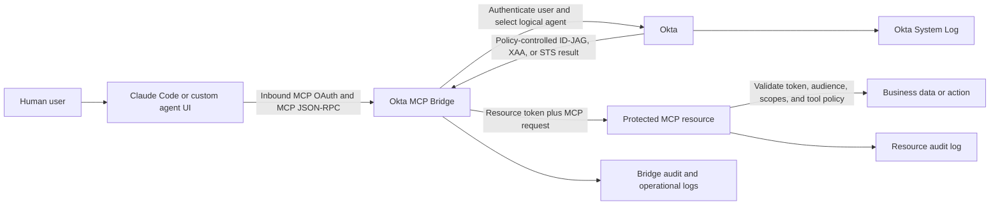
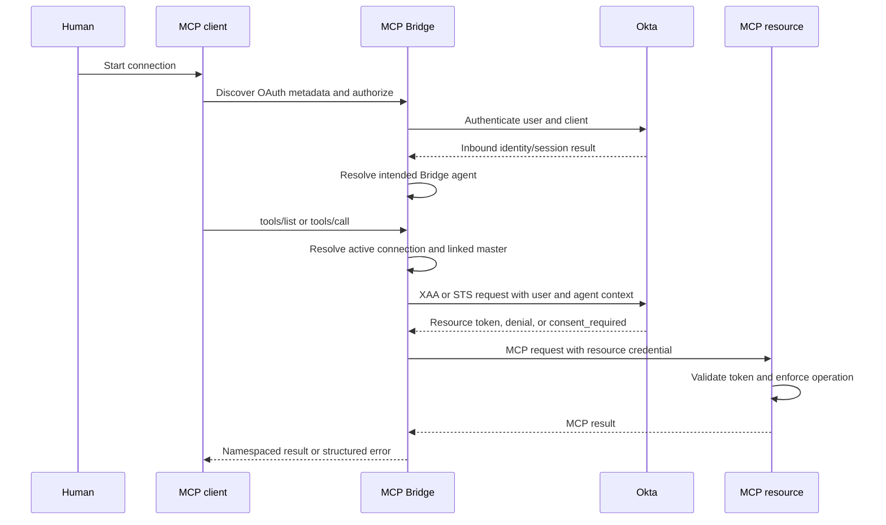

# MCP Bridge API and operator guide

This is the zero-assumption guide for integrating with and operating an already deployed Okta MCP Bridge. Read it before using the Bridge as the MCP policy enforcement point in the hybrid topology described by this repository.

The guide contains original, publishable API and operating guidance only. It contains no MCP Bridge source code. The route and behavior inventory was checked against Bridge `0.16.6` on 2026-09-11. A deployed image, database schema, feature flags, and customer patches can differ, so the running environment and release-matched documentation remain authoritative.

Detailed public MCP Bridge API schemas are not currently available at a stable public developer URL. MCP Bridge is proprietary. If a route, response, or behavior differs from this guide, stop and obtain documentation from the Bridge deployment owner or Okta Professional Services. Do not reconstruct and publish a missing schema from private source.

## What this guide enables

After reading this guide, a builder should be able to:

- explain where MCP Bridge sits between an MCP client, Okta, and protected resources;
- distinguish MCP client OAuth from Bridge administration;
- identify the Okta AI Agent, Bridge agent, Managed Connection, and master resource involved in a request;
- perform a read-only inventory without exposing credentials;
- prepare an approved 0.16 import, resource-link, Claude Code, or custom-agent workflow;
- explain XAA and STS without treating them as the same token flow;
- prove authorization with an actual tool call instead of a visible tool name;
- collect evidence that identifies the human, agent, connection, resource, decision, and result; and
- stop safely when the deployed release or API contract is unknown.

This document does not authorize a deployment or mutation. Complete the [mandatory build intake](../BUILD-START-HERE.md) first.

## Contents

1. [Mental model](#mental-model)
2. [Terms and identifiers](#terms-and-identifiers)
3. [Trust boundaries and request lifecycle](#trust-boundaries-and-request-lifecycle)
4. [Prerequisites and access](#prerequisites-and-access)
5. [Version and capability discovery](#version-and-capability-discovery)
6. [HTTP conventions and safe handling](#http-conventions-and-safe-handling)
7. [Read-only discovery](#read-only-discovery)
8. [Admin API surface](#admin-api-surface)
9. [0.16 agent import and synchronization](#016-agent-import-and-synchronization)
10. [0.16 master-resource workflow](#016-master-resource-workflow)
11. [MCP client onboarding](#mcp-client-onboarding)
12. [XAA, STS, and downstream credentials](#xaa-sts-and-downstream-credentials)
13. [Tool discovery and authorization](#tool-discovery-and-authorization)
14. [Evidence and chain of custody](#evidence-and-chain-of-custody)
15. [Troubleshooting](#troubleshooting)
16. [Mutation safety, rollback, and teardown](#mutation-safety-rollback-and-teardown)
17. [Known release-sensitive behaviors](#known-release-sensitive-behaviors)
18. [Proprietary-source boundary](#proprietary-source-boundary)
19. [Documentation and escalation](#documentation-and-escalation)

## Mental model

MCP Bridge is an identity-aware gateway between MCP clients and one or more downstream MCP resources. In the hybrid topology, it is the MCP policy enforcement point. Okta is the identity, workload-governance, and token decision plane. The downstream MCP server is the final enforcement point because it must validate the token and enforce its scopes or claims.



The Bridge does not make every decision by itself. A complete authorization result depends on all of these gates:

1. The MCP client and human authenticate to the Bridge.
2. The Bridge selects the intended logical agent.
3. That agent has an active Okta Managed Connection linked to the requested Bridge master resource.
4. Okta admits or denies the user-plus-agent token exchange for that connection.
5. The Bridge applies any enabled call-time policy.
6. The downstream MCP resource validates the presented token and authorizes the tool.

A successful login proves only the first gate. A visible tool proves only catalog discovery. A successful protected tool call proves the complete path for one user, agent, connection, resource, and point in time.

### Why Okta is essential in this path

Bridge routing alone can identify a locally configured route, but Okta makes the agent a governed first-class identity. Okta supplies the workload principal, accountable owner, lifecycle, delegation application, Managed Connections, policy-controlled token issuance, and System Log evidence. The demo must make that value visible by showing both successful delegated access and denial after policy, connection, user, or agent lifecycle changes. A local Bridge name, LiteLLM key, or caller-provided header is not a substitute for that identity and chain of authorization.

### Control plane and data plane

| Plane | Activity | Typical interface | Important caution |
|---|---|---|---|
| Control plane | Import agents, synchronize connections, create and link resources, inspect tools, manage optional policy | Bridge Admin UI and `/api/admin/*` | Requires an Admin API token and explicit mutation approval |
| Data plane | OAuth, MCP initialization, `tools/list`, `tools/call`, resource-token exchange | Bridge `/mcp` or release-specific agent/resource path | Uses the MCP user's session, not the Admin API token |
| Okta governance plane | Agent/WLP lifecycle, owner, app binding, Managed Connections, token policy | Okta Admin Console and Okta APIs | Okta object state can be newer than the Bridge's synchronized state |
| Resource plane | Validate token and execute the actual operation | Downstream MCP endpoint | The resource must reject invalid audience, issuer, expiry, and insufficient scopes |

## Terms and identifiers

The same name can appear in several systems. Record both the human-readable name and immutable ID.

| Term | Meaning | Where it is owned |
|---|---|---|
| O4AA | Okta for AI Agents, also described as Okta Secures AI | Okta |
| AI Agent / workload principal | First-class non-human identity with an owner, lifecycle, credentials, and Resource Connections | Okta |
| Logical agent | The identity assigned to an agent deployment or client experience, such as `claude-code-demo` | Architecture and Okta |
| Bridge agent | Bridge-local representation used for inbound client selection and outbound workload credentials | MCP Bridge |
| `agent_id` | Stable Bridge-local agent identifier used in Admin and MCP routing paths | MCP Bridge |
| `okta_ai_agent_id` or `principal_id` | Okta workload-principal identifier linked to the Bridge agent | Okta, referenced by Bridge |
| `client_id` | OAuth client ID of the agent's delegation application or configured credential | Okta |
| Delegation application | OIDC application used by the agent for delegated token flows | Okta |
| Managed Connection / Resource Connection | Okta-governed relationship describing how an agent may obtain access for a target authorization server, STS provider, vault secret, or service account | Okta |
| `connection_id` | Immutable ID of one Managed Connection. Always capture this instead of matching only on a display name | Okta, synchronized to Bridge |
| Master resource | Bridge-owned address-book entry containing a name, MCP URL, protocol/configuration, enabled state, and shared tool inventory | MCP Bridge |
| Resource link | Bridge-local association between one `(agent_id, connection_id)` record and one master resource | MCP Bridge |
| Resource indicator | Identifier sent in an STS flow to select the third-party resource/provider | Okta Managed Connection |
| Authorization server | Okta org authorization server or a Custom Authorization Server, depending on the token flow | Okta |
| ID-JAG | Identity Assertion Authorization Grant used to convey human and agent delegation context in XAA | Okta |
| XAA | Cross App Access. In this guide, the custom-authorization-server path that exchanges human and workload context for a resource token | Okta and Bridge |
| STS | Okta brokered token exchange for a third-party provider, often with user consent | Okta and provider |
| CIMD | Client ID Metadata Document. A URL-based OAuth client identity used by clients such as Claude Code | MCP OAuth client |
| DCR | Dynamic Client Registration. A client registers at runtime under the Bridge's configured trust policy | MCP client and Bridge |
| Cedar | Optional Bridge call-time authorization layer | MCP Bridge |
| Tool inventory | Persisted metadata observed for a master resource | MCP Bridge |
| Tool catalog | Runtime, agent-scoped list exposed to an MCP client | MCP Bridge/client cache |
| PDP | Policy decision point. Okta decides whether the required token is issued | Okta |
| PEP | Policy enforcement point. Bridge admits/routes the MCP call, while the resource enforces the final token | Bridge and downstream MCP server |

### Ownership in the 0.16 data model

| Master resource owns | Agent connection owns |
|---|---|
| Bridge resource name and downstream MCP URL | Bridge agent ID and Okta connection ID |
| Protocol, description, paths, tags, timeout, and Bridge-local config | Connection type and active state |
| Global enabled state | Authentication method derived from the Managed Connection |
| Persisted tool inventory and global tool enabled state | Target authorization server or resource indicator |
| Shared policy resource/tool identity | Scopes, scope condition, and synchronized connection metadata |

One master can be linked by multiple agents. Changing its URL, enabled state, or tool state can therefore affect every linked agent. Sync owns connection facts; an administrator owns the choice of master and its endpoint.

## Trust boundaries and request lifecycle

### Two distinct OAuth boundaries

| Boundary | Who uses it | Purpose | Credential |
|---|---|---|---|
| MCP client OAuth | Claude Code or custom agent UI | Authenticate the user/client to the Bridge MCP endpoint | Interactive Bridge/Okta OAuth session |
| Bridge Admin API | Human administrator or automation service app | Inspect or configure Bridge control-plane state | Okta org-authorization-server access token |

An MCP client token is not an Admin API token. A LiteLLM virtual key, model-provider key, Custom Authorization Server resource token, SSWS token, ID-JAG, and downstream provider token are also not substitutes for a Bridge Admin API token.

### Credential map

| Credential/artifact | Issuer/owner | Consumer | Represents | Handling rule |
|---|---|---|---|---|
| Human Admin UI access token | Okta org authorization server | Bridge Admin API | Signed-in administrator and Admin UI client | Short-lived; never copy session cookies or print token |
| API Services access token | Okta org authorization server | Bridge Admin API and guarded Okta calls | Allowlisted automation client | Mint with `private_key_jwt`; use dedicated narrowly assigned app |
| MCP inbound session/token | Bridge and Okta OAuth flow | Bridge data plane | Human plus registered inbound MCP client | Client-managed; not valid for administration |
| Agent private key | Workload credential lifecycle | Bridge outbound exchange | Proof for governed workload principal | Secret manager only; inspect status rather than material |
| Human ID token | Okta | Delegated exchange inside Bridge | Human subject/authentication context | Transient; never persist in evidence |
| ID-JAG | Okta | XAA exchange | Human-to-agent delegation context | Transient protocol artifact; never expose to client or logs |
| XAA resource token | Target Okta authorization server | Protected MCP resource | Authorized user-plus-agent resource access | Resource validates issuer, audience, expiry, scopes/claims |
| STS/provider token | Okta/provider exchange | Third-party provider/MCP resource | Provider-authorized user-plus-agent access | Bridge-side only; consent and cache lifecycle apply |
| LiteLLM virtual/model key | LiteLLM/model provider | LiteLLM/model endpoint | Model-plane routing/accounting | Never use as evidence of Bridge or Okta authorization |

### Runtime sequence



The human identity, inbound OAuth client, logical agent, workload principal, Managed Connection, and downstream resource are different actors or objects. Do not collapse them into a single `client_id` in documentation or evidence.

## Prerequisites and access

Before calling the Admin API, record these non-secret values:

- environment name and non-production status;
- Okta base domain and environment owner;
- Bridge gateway base URL and Admin UI URL;
- Bridge deployment owner;
- health version, image/build provenance, and database schema level;
- whether Bridge is the active PEP or only a fallback/reference;
- exact agent names, Bridge IDs, Okta workload-principal IDs, and owners;
- approved test users/groups;
- selected Admin API access method;
- authorized read and mutation operations; and
- secret-manager or ignored-file references, never secret values.

### Human administrator access

The operator signs in to the Bridge Admin UI through its configured Okta application. The short-lived Okta org authorization server access token can authorize `/api/admin/*` when the Admin UI client ID is allowlisted by that Bridge.

The deployment must identify the configured `ADMIN_UI_OKTA_CLIENT_ID`. A browser login can succeed while the Admin API returns `401` if the presented token's client ID is not on that allowlist.

Use human access for interactive, time-bounded administration. Do not copy a browser session cookie. Store the access token only in an approved secret manager or ignored local file for the current session. Never paste it into chat, display it in terminal output, or commit it.

### Okta API Services access

For repeatable automation, use an Okta API Services Integration with `client_credentials` and `private_key_jwt`. The service app client ID must be present in the Bridge deployment's `ADMIN_API_SERVICE_CLIENT_IDS` allowlist. If both human and service-app allowlists are empty, current 0.16 behavior fails closed.

The Admin API admission boundary in the checked 0.16.6 release is primarily org-AS token validation plus configured client-ID allowlisting. It does not provide universal route-by-route scope or admin-group authorization across every `/api/admin/*` mutation. Okta import/sync routes explicitly require `okta.aiAgents.read`, `okta.aiAgents.manage`, and `okta.apps.read`; other Okta scopes are operation-specific. Compensate with dedicated service apps, narrow app assignment, network controls, short token lifetimes, separate mutation approval, and audited use.

The broader operating baseline can require:

- `okta.aiAgents.read`
- `okta.aiAgents.manage`
- `okta.apps.read`
- `okta.authorizationServers.read`

Add `okta.apps.manage` only for an explicitly approved linked-application or credential operation. Add `okta.users.read` only if an approved support workflow must resolve a user by an attribute such as email. Add group-read access only when a deployment-specific workflow proves it is required. Do not request `openid`, `profile`, or `email` in a client-credentials grant.

The private key must remain in the selected secret manager. Use overlap during key rotation, test the new key, then retire the old key. A minted token can still receive:

- `401` when its issuer, signature, audience/client identity, expiry, or Bridge allowlist does not satisfy Bridge Admin authentication; or
- `403` when a guarded route lacks the required Okta API scopes or the upstream Okta call rejects the principal.

### Minimum Okta roles and approvals

An access token's scopes do not themselves grant permission to change an environment. Record the human/business authorization separately. At minimum, identify:

- who owns the Okta tenant;
- who approves creation or changes to AI Agents, applications, Resource Connections, authorization servers, and policies;
- who owns the Bridge deployment and can inspect its immutable image identity and feature flags; and
- who approves downstream resource and test-data changes.

## Version and capability discovery

### Why `/health` is necessary but insufficient

`GET /health` establishes basic service health and a package version. It does not prove the exact image, source revision, database schema, configuration flags, or local patches that are running.

Before a mutation, capture:

1. `/health` version;
2. immutable deployed image digest or equivalent build identifier;
3. release/build record supplied by the deployment owner;
4. current database schema level;
5. enabled optional features, including Cedar or DCR policy surfaces;
6. customer-specific patches or exceptions; and
7. the date and operator who performed discovery.

If the owner cannot establish build provenance, limit activity to approved reads and treat every payload or mutation contract as unverified.

### 0.15 versus 0.16 decision rule

| Observed release | Resource model | Required action |
|---|---|---|
| Confirmed `0.16.x` | Admin-owned master resource plus separately synchronized agent connection | Create/select the master, then explicitly link the exact connection |
| Confirmed `0.15.x` | Legacy connection-owned resource shell workflow | Obtain release-matched 0.15 documentation from the Bridge owner |
| Unknown, patched, or mixed evidence | Unknown | Stop before mutations and escalate |

Never apply a 0.15 disabled-shell rename/fill/enable repair procedure to 0.16. In 0.16, sync can legitimately leave a connection unlinked until an administrator chooses a master.

### Discover the effective resource routes

Current 0.16 builds can expose `GET /api/admin/routes`. It reports effective path-to-master-resource mappings and route aliases. It is not an inventory of Admin API endpoints. Use it to validate canonical and configured MCP resource paths, then obtain feature/API capability information from `GET /api/admin/config/public`, the deployment owner, and release-matched documentation.

## HTTP conventions and safe handling

Examples below show the HTTP contract, not application code.

```http
GET /api/admin/agents HTTP/1.1
Host: <bridge-gateway-host>
Authorization: Bearer <org-as-admin-access-token>
Accept: application/json
```

For JSON mutations, include `Content-Type: application/json`. Use the gateway base URL confirmed by the deployment owner. Some deployments proxy Admin API calls through the Admin UI host, but that must not be assumed.

### Identifier rules

- Treat `agent_id`, `okta_ai_agent_id`, `connection_id`, resource name, application ID, OAuth `client_id`, and user `sub` as different identifiers.
- Treat generic `resource_id` fields as ambiguous until you identify whether they refer to a Bridge master, an Okta authorization server, or another connection-side target. Prefer explicit field names and the nested linked-resource object.
- Preserve identifier case exactly.
- URL-encode path values when required by the HTTP client.
- Select by immutable ID, then verify the human-readable name and owner.
- Never select a connection solely because its display label contains a familiar word.

### Response handling

- Retain only fields required for the task.
- Redact tokens, private keys, client secrets, proxy secrets, session cookies, authorization headers, user PII, customer hostnames, and business data.
- Current 0.16 agent list/detail responses redact known credential fields. Continue to filter responses because release behavior can differ.
- Do not save raw audit exports or cloud logs in this repository.
- Do not retry a POST, PUT, PATCH, or DELETE automatically unless the route's idempotency contract is release-matched and the resulting state has been read back.

### Common response classes

| Status | Typical meaning | First response |
|---|---|---|
| `200` | Read/update succeeded, or a route returned a structured workflow result | Inspect body and re-read state where relevant |
| `201` | Object or Okta-side connection created | Capture returned ID and re-read |
| `204` | Successful operation with no response body | Re-read the parent state |
| `400` | Invalid field, body, selection, or workflow state | Compare with release-matched contract; do not guess fields |
| `401` | Admin token missing, invalid, expired, wrong issuer, or client ID not allowlisted | Verify token metadata and Bridge allowlist |
| `403` | Token admitted but a guarded route or upstream Okta call lacks permission | Verify operation-specific grants and tenant |
| `404` | Target not found or route absent in this release | Verify ID, base path, version, and feature flag |
| `409` | Duplicate name/link or unsafe conflict | Read current state; do not work around the constraint blindly |
| `502` | Bridge could not complete an Okta/provider dependency call | Correlate upstream status and logs |
| `503` | Store or optional subsystem is unavailable/not configured | Verify deployment health and feature configuration |

Treat an HTTP `200` containing `selection_required`, `success: false`, warnings, or a JSON-RPC error as a workflow result that still needs interpretation.

## Read-only discovery

Read-only discovery is the default first action after access is approved.

### Ordered sequence

| Order | Method and path | Establishes | Fields to record |
|---|---|---|---|
| 1 | `GET /health` | Basic service and package version | health, version |
| 2 | `GET /api/admin/config/public` | Non-secret deployment/routing/feature settings exposed by this release | only values relevant to the workflow |
| 3 | `GET /api/admin/routes` | Effective MCP path-to-master routing | path, resource name/URL, canonical or alias, enabled state |
| 4 | `GET /api/admin/agents` | Bridge agents and Okta linkage | `agent_id`, name, enabled, registration source, Okta ID, client mode |
| 5 | `GET /api/admin/resources` | Master resources | ID/name, type, exact URL, enabled, tags |
| 6 | `GET /api/admin/agents/{agent_id}/connections` | Live Okta connections plus Bridge linkage | connection ID/type/status, scopes/condition, resource indicator, linked master, stats |
| 7 | `GET /api/admin/connections/status` | Last synchronization result | status, timestamps, unresolved count |
| 8 | `GET /api/admin/resources/tool-counts` | Tool inventory summary | total, unclassified, disabled by resource |
| 9 | `GET /api/admin/agents/{agent_id}/tools` | Persisted tools reachable through linked masters | resource names, tools, enabled state |
| 10 | `GET /api/admin/tools/discovery-state` | Discovery freshness and state | per-resource success/error/freshness |
| 11 | `GET /api/admin/audit` | Bridge configuration-administration evidence | event time/type, actor reference, entity, outcome |
| 12 | `GET /api/admin/events/logs` | Runtime/security event evidence when configured | correlation, agent/user/resource/outcome without secrets |

Optional reads, when relevant and confirmed for the deployed release:

- `GET /api/admin/okta/org` to confirm the Bridge's Okta organization;
- `GET /api/admin/okta/service-app` to inspect provisioning status without creating anything;
- `GET /api/admin/okta/agents` to list importable Okta agents;
- `GET /api/admin/okta/agents/{okta_agent_id}` for an import candidate;
- `GET /api/admin/okta/agents/{okta_agent_id}/delegation-apps` when delegation-app selection may be ambiguous;
- `GET /api/admin/resources/{name}` for one master and link summary;
- `GET /api/admin/resources/{name}/tools` for its persisted inventory;
- `GET /api/admin/resources/isolation-status` and `/merge-candidates` for shared-master diagnostics;
- `GET /api/admin/dcr/registrations` and `/api/admin/dcr/policy` for DCR diagnosis; and
- `GET /api/admin/token-store/stats` for aggregate session-store health, never raw tokens.

### Interpret the agent connection response

`GET /api/admin/agents/{agent_id}/connections` is the most useful single diagnostic read. It combines several states that must remain distinct:

| Response concept | Interpretation |
|---|---|
| `agent` | Redacted Bridge-local agent record |
| `okta_agent` | Live Okta workload-principal detail, if reachable and linked |
| `connections[]` | Current Okta Managed Connections with Bridge linkage information |
| `connection_id` | Exact target for a future link/unlink or diagnosis |
| `connection_type` | Determines whether XAA, STS, vault, or another credential path is expected |
| `status` | Whether Okta currently considers the connection active |
| `scopes` and `scope_condition` | Inputs to XAA scope calculation, not a tool list |
| `resource_indicator` | STS/provider target selector, not an XAA scope |
| linked `resource` | Bridge master selected for this exact connection |
| `stats` | Summary only. Always inspect individual connection rows before mutation |

This endpoint depends on live Okta reads in current 0.16 behavior. A dependency error does not prove the persisted Bridge link vanished. Correlate the master detail, last sync status, and deployment logs before attempting repair.

### Discovery completion artifact

Record a redacted table with one row per intended route:

| Agent name/ID | Okta WLP ID | Connection ID/type/status | Master name/ID | Exact MCP URL | Enabled | Expected token path | Verification status |
|---|---|---|---|---|---|---|---|
| `<name>/<id>` | `<wlp-id>` | `<connection>/<type>/<status>` | `<master>/<id>` | `<redacted non-secret endpoint>` | yes/no | XAA or STS | read-only/runtime pending |

Do not store tokens, private keys, user claims, or customer data in this artifact.

## Admin API surface

This inventory documents externally useful operations without reproducing private implementation or internal schemas. Route availability and payloads remain release-specific.

### Agents and credentials

| Method | Path | Purpose | Risk |
|---|---|---|---|
| GET | `/api/admin/agents` | List Bridge agents | Read |
| GET | `/api/admin/agents/{agent_id}` | Read one agent | Read |
| POST | `/api/admin/agents` | Manually create a Bridge agent | High; prefer approved Okta import for governed agents |
| PUT | `/api/admin/agents/{agent_id}` | Update agent metadata, client mode, or credentials | High |
| DELETE | `/api/admin/agents/{agent_id}` | Delete Bridge agent | Destructive |
| GET | `/api/admin/agents/{agent_id}/credentials/status` | Inspect credential presence/status without revealing material | Read |
| POST | `/api/admin/agents/{agent_id}/credentials/fetch-secret` | Fetch authorized credential material from Okta | Secret-bearing workflow |
| POST | `/api/admin/agents/{agent_id}/credentials/generate-keypair` | Generate and bind credentials | High, can change Okta and Bridge state |
| GET | `/api/admin/agents/{agent_id}/proxy-secret/status` | Inspect compatibility-secret status | Read |
| POST | `/api/admin/agents/{agent_id}/proxy-secret` | Mint a compatibility secret | High; plaintext can be returned once |
| POST | `/api/admin/agents/{agent_id}/proxy-secret/rotate` | Rotate compatibility secret | High; old secret can stop immediately |
| POST | `/api/admin/agents/{agent_id}/proxy-secret/reveal` | Reveal compatibility secret | Critical, secret disclosure |
| DELETE | `/api/admin/agents/{agent_id}/proxy-secret` | Revoke compatibility secret | Destructive |

Do not use direct manual agent creation to bypass the governed Okta agent lifecycle. Do not use proxy secrets when the client supports CIMD, DCR, or another approved stronger mode.

### Okta agent import and synchronization

| Method | Path | Purpose | Risk |
|---|---|---|---|
| GET | `/api/admin/okta/agents` | List importable Okta AI Agents | Read, can be rate-sensitive |
| GET | `/api/admin/okta/agents/{okta_agent_id}` | Inspect candidate and matching state | Read |
| GET | `/api/admin/okta/agents/{okta_agent_id}/delegation-apps` | List selectable delegation apps | Read |
| GET | `/api/admin/okta/potential-connections?type=<type>&match=<value>` | Discover candidates for an approved connection workflow | Read |
| POST | `/api/admin/okta/agents/{okta_agent_id}/import` | Import one governed agent | Reconciliation mutation |
| POST | `/api/admin/okta/agents/bulk-import` | Import several agents | Broad reconciliation mutation |
| POST | `/api/admin/okta/agents/{okta_agent_id}/sync` | Synchronize one imported agent | Reconciliation mutation |
| POST | `/api/admin/okta/sync/agents` | Synchronize all imported agents | Broad reconciliation mutation |
| POST | `/api/admin/connections/sync` | Refresh Managed Connection state | Broad reconciliation mutation |
| POST | `/api/admin/okta/sync/all` | Combined agent and connection synchronization | Broad reconciliation mutation |
| POST | `/api/admin/okta/agents/{okta_agent_id}/connections` | Create a Managed Connection through Okta | External high-impact mutation |

Do not guess the body for creating an Okta Managed Connection. The contract is connection-type and Okta-release specific. Obtain the matching Okta or Bridge-owner documentation.

### Master resources and links

| Method | Path | Purpose | Risk |
|---|---|---|---|
| GET | `/api/admin/resources` | List master resources | Read |
| GET | `/api/admin/resources/{name}` | Read one master and related summary | Read |
| POST | `/api/admin/resources` | Create a master | Mutation, initially prefer disabled |
| PUT | `/api/admin/resources/{name}` | Partial update of admin-owned master fields | Potentially broad if shared |
| DELETE | `/api/admin/resources/{name}` | Delete an unlinked master | Destructive |
| DELETE | `/api/admin/resources/{name}?force=true` | Delete and detach linked connections | Critical/destructive |
| GET | `/api/admin/resources/isolation-status` | Inspect sharing/isolation state | Read |
| GET | `/api/admin/resources/merge-candidates` | Find possible duplicate masters | Read |
| POST | `/api/admin/resources/{name}/merge` | Repoint connections and remove source master | Critical/destructive |
| GET | `/api/admin/agents/{agent_id}/connections` | Inspect connection/master linkage | Read |
| PUT | `/api/admin/agents/{agent_id}/connections/{connection_id}/resource` | Link exact connection to a master | Routing mutation |
| DELETE | `/api/admin/agents/{agent_id}/connections/{connection_id}/resource` | Unlink while preserving synchronized connection row | Routing removal |
| GET | `/api/admin/routes` | Inspect the effective master routing map | Read; this is not an API route catalog |

Connection authentication configuration is Okta/synchronization-owned. The checked release does not expose a supported Admin route for arbitrary connection authentication updates. Do not put connection auth configuration on a master or infer an undocumented endpoint. Escalate to the Bridge owner.

### Tool inventory

| Method | Path | Purpose | Risk |
|---|---|---|---|
| GET | `/api/admin/tools` | Search/filter persisted inventory | Read |
| GET | `/api/admin/resources/tool-counts` | Per-master summary | Read |
| GET | `/api/admin/resources/{name}/tools` | Master inventory and discovery state | Read |
| GET | `/api/admin/agents/{agent_id}/tools` | Inventory reachable through linked masters | Read; not authorization evidence |
| GET | `/api/admin/tools/discovery-state` | Discovery status by master | Read |
| POST | `/api/admin/resources/{name}/tools/discover` | Trigger active discovery | Reconciliation/network call; unavailable for some user-context auth methods |
| POST | `/api/admin/tools/discover` | Trigger broad discovery | Broad reconciliation/network calls |
| PUT | `/api/admin/resources/{name}/tools/{tool_name}` | Classify or update tool metadata | Shared configuration mutation |
| PUT | `/api/admin/resources/{name}/tools/bulk-classify` | Bulk-classify tools | Broad mutation |
| POST | `/api/admin/resources/{name}/tools/{tool_name}/enable` | Globally enable persisted tool | Shared behavior mutation |
| POST | `/api/admin/resources/{name}/tools/{tool_name}/disable` | Globally hide/disable persisted tool | Shared behavior mutation |
| GET/PUT/DELETE | `/api/admin/resources/{name}/tools/{tool_name}/annotations` | Read/change/remove annotations | Read or shared metadata mutation |

Relevant tool-list endpoints can support pagination, search, inclusion of disabled tools, and filters such as resource, sensitivity, and enabled state. Treat exact query names and envelopes as release-specific until checked against the running response.

### Audit, sessions, client registration, and optional policy

| Area | Representative routes | Notes |
|---|---|---|
| Configuration audit | `GET /api/admin/audit`, agent/resource audit, audit export | Exports are sensitive reads even though they are GETs |
| Runtime events | `GET /api/admin/events/logs`, event export | Availability depends on the configured cloud log provider |
| Session diagnostics | `GET /api/admin/token-store/stats` | Aggregate status only |
| Session revocation | token-store user deletion and `POST /api/admin/users/force-logout` | High-impact, user-visible mutation |
| User visibility | `GET /api/admin/users/{okta_user_id}/visible-agents` | Support read; bypass-cache can cause live dependency calls |
| DCR | registration/policy reads, revoke/unlink, redirect-pattern updates, per-agent selectability | Trust-boundary configuration; use separate approval |
| Okta organization | organization/configuration status reads and refresh | A refresh is a reconciliation mutation |
| Okta service app | status read and provision action | Provision changes Okta and secret state |
| Cedar | policy/schema/template/entity/analytics reads; create/update/delete/enable/disable/validate/simulate | Feature-gated and release-sensitive |
| Cedar authoring | optional natural-language and MCP authoring routes | Generated policy is not trusted until reviewed and tested |

`GET` does not always mean low sensitivity. Audit/log exports and cache-bypass reads can expose data or create significant load. A route named `simulate`, `discover`, `sync`, `import`, or `export` must be classified by its observed effects and data handling, not its label.

## 0.16 agent import and synchronization

Use import when the Okta AI Agent already exists and Bridge should manage a local representation of it. Import is preferable to manually creating a disconnected Bridge-only identity.

### Pre-import checks

1. Confirm the exact non-production Okta tenant.
2. Confirm the Okta AI Agent ID, display name, owner, status, and intended client experience.
3. Confirm its delegation application and credential method.
4. List its Managed Connections and record the exact IDs, types, and status.
5. Search Bridge agents to prove it is not already imported under another name.
6. If multiple delegation apps are candidates, list them and have the owner select the exact application ID.
7. Obtain approval for the import and any synchronization it triggers.

### Import request contract

The minimal import body is empty:

```http
POST /api/admin/okta/agents/{okta_agent_id}/import
Content-Type: application/json

{}
```

Release `0.16.6` accepts these optional concepts:

| Field | Use |
|---|---|
| `agent_name` | Approved Bridge display-name override |
| `resource_mapping` | Explicit mapping only when the release-matched workflow requires it |
| `selected_delegation_app_id` | Exact app selected after an ambiguous-candidate response |

If the response sets `selection_required: true`, stop and select one returned delegation-app candidate. Do not guess based on list order or client ID resemblance. An HTTP `200` is not proof of a completed import when this flag is present.

### Post-import verification

1. Re-read `GET /api/admin/agents` and locate exactly one Bridge agent linked to the intended Okta ID.
2. Read `GET /api/admin/agents/{agent_id}` and verify enabled state, registration source, Okta linkage, and client mode.
3. Read `GET /api/admin/agents/{agent_id}/connections`.
4. Compare every connection ID/type/status with current Okta state.
5. Confirm the actual master link rather than assuming every connection is new or unlinked.
6. Treat any import response `resources_linked` field as advisory matching output, not persisted proof.
7. Verify credentials by status, never by revealing them.
8. Record warnings and incomplete post-import sync results.

### Synchronization semantics

Synchronization is reconciliation, not a simple append. It refreshes Okta-owned connection facts and can add/update connection rows, active state, scopes, metadata, caches, and audit events.

In the checked 0.16.6 behavior:

- a genuinely new connection normally appears without a master link;
- an unambiguous replacement connection can inherit the disabled predecessor's master link;
- an authoritative sync can retain a missing/inactive row, disable it, and preserve its link; and
- reactivation can re-enable a retained connection.

These are release-sensitive behaviors. Always re-read the exact current `connection_id`. Prefer the narrowest approved route:

1. synchronize one imported agent;
2. re-read that agent's connections;
3. use connection-wide or all-agent sync only when the intended scope is genuinely broad; and
4. compare before/after snapshots for unexpected disabled, omitted, replaced, duplicate, inherited, or unlinked connections.

Do not use repeated sync as a generic repair. If the underlying Okta object, Bridge link, or master URL is wrong, synchronization cannot safely infer the administrator's intended endpoint.

## 0.16 master-resource workflow

### Create, link, verify, then enable

For a new protected MCP target:

1. Confirm the intended agent is imported.
2. Re-read its current connections and capture the exact active `connection_id`.
3. Confirm the connection type matches the desired XAA or STS path.
4. Search existing masters by exact endpoint and purpose. Reuse only when sharing is intentional.
5. Create a new master disabled unless change approval explicitly authorizes immediate traffic.
6. Link the exact `(agent_id, connection_id)` to the master.
7. Re-read both the master and agent connection.
8. Confirm the expected sharing/isolation impact.
9. Enable the master with separate awareness that the setting is global to all linked agents.
10. Authenticate a real test user and test both allowed and denied calls.

Example master contract:

```http
POST /api/admin/resources
Content-Type: application/json

{
  "name": "swiss-army-demo",
  "type": "mcp",
  "url": "https://<approved-host>/<exact-mcp-path>",
  "description": "Non-production Swiss Army MCP demo",
  "tags": ["demo", "non-production"],
  "timeout_seconds": 30,
  "enabled": false
}
```

Use placeholders in documentation and the actual approved endpoint only in the environment's controlled change record. Do not commit a customer-private hostname if it is considered sensitive.

Connection link contract:

```http
PUT /api/admin/agents/{agent_id}/connections/{connection_id}/resource
Content-Type: application/json

{
  "resource_name": "swiss-army-demo"
}
```

### Fields that do not belong on a master

Do not send connection-owned fields such as:

- agent or connection IDs;
- connection type or connection-side resource ID;
- scopes or scope condition;
- auth method; or
- synchronized connection metadata/auth configuration.

Current 0.16 rejects these concepts when sent to master creation. Fix the Okta Managed Connection or use a release-approved connection workflow instead of forcing synchronized values into the master.

### Link constraints and sharing impact

- One agent can link to a given master through at most one connection.
- A duplicate link can return `409`.
- One master can be shared across several agents.
- A master URL change redirects every linked route.
- A global master or tool disable affects all linked agents and users.
- An unlink preserves the synchronized connection row but removes Bridge routing.
- A force delete can detach multiple connections.
- A merge can move links/inventory and remove the source master.

Before changing a shared master, enumerate every linked agent and obtain approval for that blast radius.

### Required post-change proof

After create, update, link, unlink, merge, enable, or disable:

- re-read the target master;
- re-read the target agent's connections;
- verify name, immutable IDs, URL, enabled state, connection type/status, scopes/condition, and resource indicator;
- verify connection statistics do not hide another unlinked record;
- inspect the related Bridge configuration-audit event;
- reconnect the MCP client when client/catalog caching matters; and
- execute a positive and negative runtime test.

## MCP client onboarding

Client onboarding configures the inbound boundary only. It must not overwrite the Okta workload principal or Managed Connection used at the outbound boundary.

### Claude Code with CIMD

Current 0.16 guidance uses this exact Claude Code Client ID Metadata Document:

```text
https://claude.ai/oauth/claude-code-client-metadata
```

The Admin API write concept is `cimd_client_id`; the persisted/read concept can appear as `cimd_client_id_url`. Configure the imported Bridge agent for CIMD client mode while preserving:

- the Okta workload-principal link;
- the agent's outbound Okta `client_id` or effective client identity;
- private-key credential status; and
- its Managed Connections.

Do not force the Okta workload-principal client ID into Claude Code as the inbound OAuth client ID when using the CIMD pattern.

When multiple Bridge agents share Claude's CIMD URL, prefer the agent-scoped MCP URL `/mcp/{bridge-agent-id}` when that routing mode is enabled. In the checked release, the path is authoritative and a conflicting `X-MCP-Agent` header is rejected. Treat the header only as a routing hint, never authorization proof. Test that a token/session bound to one agent cannot select another agent through either path or header.

An `invalid_client` or CIMD trust-policy rejection commonly means one of these:

1. the Bridge agent is not in the expected client mode;
2. its stored CIMD URL is absent or not an exact match;
3. the MCP route selected a different agent;
4. the agent hint/path is missing or inconsistent; or
5. the deployment's CIMD trust policy does not accept that document.

Verify agent state and selection before broadening a global CIMD trust policy. A shared CIMD identity identifies the inbound client software pattern; it is not cryptographic attestation of a specific Claude binary or unique logical agent.

### Custom agent UI

Give the custom UI its own:

- logical agent name and owner;
- Okta AI Agent/workload principal;
- delegation credentials;
- Bridge agent record;
- inbound OAuth client identity/mode;
- Managed Connections;
- telemetry labels; and
- test evidence.

Do not reuse Claude's logical agent, CIMD identity, session, signing credential, or model credential. A browser-based public client should use authorization code with PKCE and must not receive an Admin API token, agent private key, or downstream resource token.

Validate exact redirect URIs, `state`, nonce where applicable, PKCE, CSRF protection, session fixation defenses, secure cookies, and logout. If confidential credentials are required, terminate them in a customer-controlled backend-for-frontend, not browser code.

Choose one supported registration mode with the Bridge owner:

| Mode | Suitable when | Required checks |
|---|---|---|
| Pre-registered client | Customer controls a stable OAuth client | Exact redirect URIs, PKCE, client-to-agent binding, lifecycle |
| CIMD | Client publishes a trusted metadata document | HTTPS retrieval, SSRF protections, exact URL binding, cache/rotation behavior |
| DCR | Client must register dynamically | Redirect allowlist, registration limits, approval/linking, revocation, no privilege by self-assertion |
| Proxy-secret compatibility | Legacy client cannot use supported modern modes | Explicit exception, secure delivery, rotation/revocation, narrow scope, migration plan |

### MCP URL and path selection

A deployment can expose unified `/mcp`, agent-scoped `/mcp/{agent}`, and agent/resource-scoped `/mcp/{agent}/{resource}` forms. Availability depends on deployment mode. Do not invent the URL from a resource name.

Obtain the exact target from the Bridge owner and the deployment's OAuth protected-resource/authorization-server metadata. Verify:

- scheme, host, and path are exact;
- TLS certificate and DNS are correct;
- the path selects the intended agent/resource;
- OAuth metadata points to the expected issuer;
- the client sends the approved selector if required; and
- the selected agent is visible in runtime evidence.

### DCR and compatibility-secret safety

DCR redirect patterns and per-agent selectability are trust policy, not convenience settings. Never add a wildcard redirect to make a client work. Inspect the registration, requested redirects, linked agent, and revocation state first.

Proxy-secret mint, reveal, rotate, and revoke operations can expose or immediately invalidate credentials. Never call reveal for diagnosis when status is sufficient. If plaintext is returned during an approved operation, deliver it directly to the selected secret manager without printing or persisting the response. If it reaches terminal scrollback, shell history, CI logs, chat, an issue, or an unencrypted file, treat it as exposed and rotate it.

## XAA, STS, and downstream credentials

### XAA path

Use the XAA mental model for a Managed Connection targeting an Okta Custom Authorization Server:

1. the human authenticates on the inbound Bridge leg;
2. Bridge resolves the selected workload principal and exact connection;
3. Bridge computes a non-empty scope request from caller/custom scopes and synchronized connection scopes;
4. Okta evaluates the human-plus-agent delegation and issues or denies the ID-JAG/resource token flow;
5. Bridge presents the resource token to the downstream MCP endpoint; and
6. the downstream endpoint validates the token and tool-specific authority.

Current 0.16 scope calculation is conceptually:

| Connection condition | Effective XAA scope request |
|---|---|
| `ALLOW_ALL` or absent | Union of caller custom scopes and connection scopes |
| `INCLUDE_ONLY` | Intersection when caller custom scopes exist; otherwise configured connection scopes |
| `DISALLOW` or `EXCLUDE` | Caller custom scopes minus configured blocked scopes |
| Unknown condition | Empty, which should fail rather than guess |

Bridge protocol pseudo-scopes `mcp.read` and `mcp.write` are removed from this calculation. Colon-form resource scopes such as `mcp:read` remain ordinary downstream scopes. Current 0.16 XAA exchange requires a non-empty effective result. If an `ALLOW_ALL` connection has no materialized scopes, verify synchronization and the target authorization server's advertised and approved scopes.

Scopes govern token admission. They do not inherently change the tool catalog. A downstream MCP server must map token scopes or claims to a tool if per-tool authorization is required.

### Combined versus split read/write access

With one connection that requests both read and write scopes, Okta may require the full request to be granted. A denied write scope can therefore prevent the resource token entirely rather than automatically falling back to read-only.

If the requirement is “Sarah can read but cannot write,” design and test an explicit boundary. Options can include separate Managed Connections and masters/endpoints or resource-side per-tool scope enforcement. Do not promise read fallback or per-user tool hiding merely because read and write scopes appear in one connection.

### STS path

STS is a different flow used for a third-party provider/resource:

1. Bridge resolves an active, linked STS connection and its resource indicator;
2. Bridge sends the human identity token, agent credentials, and resource indicator through the brokered exchange;
3. Okta/provider returns a token, a denial, or `interaction_required` with a consent URL;
4. the user completes provider consent when required; and
5. the tool call is retried after consent.

Connection `scopes` shown for an STS record are not processed through the XAA scope-condition table in checked 0.16.6 behavior. Do not describe an STS connection scope as proof of per-tool enforcement.

No consent page can be correct when the provider was already authorized. It can also indicate the wrong agent, no matching linked/routable STS connection, a resource-indicator mismatch, missing workload credentials, or callback agent-selection failure. Prove the selected path from correlated evidence.

During a tool call, current 0.16 can return a JSON-RPC error with code `-32001`, `type: consent_required`, and an interaction URL. Treat that URL as sensitive workflow data. Complete it in the user's browser and retry the same operation. Never have an automation agent consent on the user's behalf.

### Vault or service-account connections

Vault-secret and service-account connections are non-human credential paths with different lifecycle and consent properties. Their presence does not prove XAA parity. Require release-matched documentation for credential acquisition, caching, rotation, audit, and revocation before including them in the build.

### Token and session caching

Caches can preserve previously admitted tokens, provider consent, tool catalogs, and downstream MCP sessions. After changing scopes, policies, links, or credentials:

- do not use an existing warm session as proof of new behavior;
- use a supported session/cache invalidation or reconnect workflow only with approval;
- wait for token expiry when that is the safe documented method;
- test a fresh authorization path; and
- retain evidence of cache state and test order.

Current XAA token isolation includes user, agent, connection, and resource dimensions. Current STS token caching uses the user and resource indicator. Downstream MCP session reuse can be based on user and resource URL. When the same resource indicator or URL appears under multiple agents/connections, run explicit isolation tests before claiming separation.

Never delete live cache or user sessions merely to manufacture a test result.

## Tool discovery and authorization

### Three different tool views

| View | Scope | What it proves |
|---|---|---|
| Master tool inventory | Shared, persisted observations for a master | What tools have been observed/configured globally |
| Runtime Bridge catalog | Primarily agent-scoped and cached | What names/schemas Bridge can advertise for that agent |
| Client-local catalog | Cached by Claude Code or custom UI | What that client last received |

None of these proves the current user can execute a tool.

### Discovery behavior

Tool metadata can come from:

1. a warm Bridge agent catalog;
2. persisted master inventory; or
3. live downstream `tools/list` discovery.

Only a cold live path necessarily attempts the current user's resource authentication first. Once an allowed user populates shared inventory or an agent catalog, a denied user may see the same tool name and still fail at `tools/call`. Test execution, not names.

Admin-triggered discovery can be passive-only for XAA/STS resources because those methods require a human context. Populate those resources through an authenticated MCP client's `tools/list`, then verify passive inventory backfill. A `passive_only_resource` result is not automatically an error.

Runtime names are generally namespaced as `<master>__<tool>`. Classification, annotations, and enabled state belong to the shared master inventory, not to one user.

### Runtime call enforcement

For each `tools/call`, the expected 0.16 sequence is:

1. parse the namespaced master/tool name;
2. resolve the selected agent;
3. prove that agent's connection is active and linked to the master;
4. resolve XAA, STS, or other resource authentication for this call/user;
5. return a denial or consent requirement when credentials are unavailable;
6. run optional Cedar call-time policy; and
7. forward the original tool name and arguments to the exact master URL.

The downstream resource must then verify issuer, signature, audience, time claims, subject/delegation context, and required scope/claim before executing the operation.

### Cedar's role and limits

Cedar is an optional additional Bridge call-time layer. For current 0.16 behavior:

- it evaluates during `tools/call`, not `tools/list`;
- disabled Cedar permits by default;
- absence of an applicable resource/tool policy can permit;
- engine exceptions can fail open;
- collected tool arguments are not included in the effective policy evaluation; and
- master/tool policy identity is shared wherever the master is shared.

Do not use current Cedar behavior as the only critical write boundary without an explicit risk decision and release-specific remediation/testing. Prefer Okta token admission plus downstream resource-token enforcement, with Cedar as defense in depth. Do not claim argument-sensitive limits such as quantity thresholds unless the deployed release is changed and proven to enforce them.

### Required two-user validation matrix

Use synthetic users in an isolated non-production environment.

| Order | Identity | Catalog expectation | Read call | Write call | Required evidence |
|---|---|---|---|---|---|
| Cold 1 | Denied user | Tool may be absent | Expected policy result | Denied | Agent/connection plus token decision/correlation |
| Cold 2 | Allowed user | Endpoint tools appear | Allowed | Allowed if policy permits | Token success and downstream result |
| Warm 1 | Denied user again | Names may now appear | Expected policy result | Still denied | Per-call denial, not tool count |
| Reverse | Allowed then denied after an approved true-cold reset | Repeat | Repeat | Repeat | Execution remains policy-correct regardless of order |

Also test wrong agent selection, wrong audience, expired token, disabled connection/master/tool, missing scope, stale client catalog, and deactivated workload principal. A demo is incomplete if it includes only one happy-path call.

## Evidence and chain of custody

The customer value is not merely that a call succeeded. Evidence must show who acted, which governed agent acted, which policy/token path admitted the call, what resource/tool was reached, and the outcome.

MCP Bridge does not independently establish the complete “who, what, and why.” Bridge events can establish identity/routing/exchange/tool facts, but the initiating prompt, model-routing rationale, complete tool arguments, and authoritative downstream mutation require evidence from the agent, LiteLLM, and downstream MCP system.

### Minimum evidence fields

| Category | Capture |
|---|---|
| Time | UTC timestamp and synchronized clock source |
| Correlation | Request/correlation ID propagated or deterministically joined across systems |
| Human | Stable synthetic-user `sub`; redact email unless required |
| MCP client | Client mode and logical client identity, such as Claude CIMD URL or custom client ID |
| Agent | Bridge `agent_id`, Okta workload-principal ID, logical name, owner |
| Connection | Exact connection ID, type, active state, scopes/condition or resource indicator |
| Resource | Master ID/name, protected audience/resource, redacted endpoint identifier |
| Decision | XAA/STS path, grant/deny/consent result, policy reference where available |
| Tool | Namespaced Bridge tool and original downstream tool |
| Result | Allowed/denied/error plus downstream enforcement outcome |
| Build | Bridge version and immutable deployment build/image reference |

### Evidence sources

- Bridge `GET /api/admin/audit` for configuration changes;
- Bridge `GET /api/admin/events/logs` and durable log sink for runtime/security events;
- Okta System Log and O4AA/authorization events;
- downstream MCP resource access/audit logs;
- Claude Code or custom UI trace for initiating context; and
- LiteLLM logs for the separate model path in this repository's hybrid demo.

Configure durable ingestion, retention, access control, clock synchronization, ingestion monitoring, and a periodic canary event before claiming durable chain of custody. Live-test actor attribution for the mutation routes used in the demo. A configuration audit record alone does not prove downstream execution.

Do not rely on a time-window join alone. Prefer a trusted-edge correlation ID or an explicit mapping between IDs. A caller-supplied correlation ID is not trustworthy on its own; combine it with authenticated identity and immutable timestamps.

### Evidence handling

- Retain redacted extracts, not raw tokens or complete customer logs.
- Hash or omit sensitive identifiers when the demo does not require them.
- Record the query/filter and time range used.
- Distinguish observed facts from interpretation or model-generated rationale.
- Record cache state and test order.
- Keep production debug logging disabled unless explicitly approved.
- Validate log redaction before sharing excerpts.
- Store the bundle outside this public repository unless it contains synthetic, approved data only.

## Troubleshooting

Diagnose from the outside in. Do not mutate while evidence is still ambiguous.

### Admin API returns `401`

1. Confirm the token is an access token from the same tenant's org authorization server.
2. Check expiry and not-before time locally without printing the token.
3. Confirm issuer and signature/JWKS reachability.
4. Confirm token client identity matches the appropriate Admin UI or service-app allowlist.
5. Confirm the request reached the intended Bridge host and path.
6. If a browser login worked, do not assume the API allowlist is correct.

### Admin API returns `403`

1. Identify whether Bridge or the upstream Okta API produced the denial.
2. Confirm the route has operation-specific scope requirements.
3. Confirm the service app has the necessary grant, assignment, and admin role/resource set.
4. Confirm the request targets the same Okta tenant.
5. For import/sync, verify the three explicitly required scopes: `okta.aiAgents.read`, `okta.aiAgents.manage`, and `okta.apps.read`.
6. Do not replace the service token with an SSWS token unless release documentation and the user explicitly authorize that separate method.

### Agent exists but no resource is usable

1. Read the exact Bridge agent and confirm it is enabled.
2. Confirm Okta workload-principal linkage and status.
3. Read agent connections and identify the exact active connection.
4. Confirm it links to the intended master.
5. Confirm master URL/type/enabled state.
6. Confirm connection type, scopes/condition or resource indicator.
7. Check last synchronization status and unresolved records.
8. Test runtime authentication before tool inventory.

An unlinked genuinely new connection after 0.16 sync is expected until an administrator chooses a master. A replacement connection can behave differently, so inspect the persisted link.

### Import says resources were linked, but routing fails

Treat import output as advisory. Re-read the persisted connection/master relation. If it is unlinked, use the explicit link workflow after approval. If linked, verify master enabled state and exact URL before discovering tools.

### Connected but zero tools

1. Prove the client selected the intended agent.
2. Prove the connection is active and linked.
3. Prove the master is enabled and the URL is the exact Streamable HTTP MCP endpoint.
4. Inspect discovery state and persisted inventory.
5. For XAA/STS, perform discovery as an authenticated user; an admin discovery route may be passive-only.
6. Check downstream MCP reachability, TLS, protocol response, and token validation.
7. Reconnect the client to refresh its own stale catalog only through an approved workflow.

### Tool is visible but invocation is denied

This can be correct. Check:

1. current user and selected agent;
2. exact connection type and link;
3. XAA effective scopes or STS resource indicator;
4. lower-level token exchange result, not only a generic wrapper error;
5. Cedar call-time outcome if enabled;
6. downstream token validation/scope decision; and
7. cached token/session age after configuration changes.

Do not change tool inventory to repair a token admission denial.

### XAA returns a generic authentication failure

1. Confirm a non-empty effective scope set.
2. Confirm the target Custom Authorization Server and audience.
3. Confirm user token issuer/client and required human context.
4. Confirm workload-principal credential status and connection state.
5. Correlate the initial ID-JAG step, final resource-token exchange, and Okta error event.
6. Inspect final token claims only through a redacted, approved method.

A high-level `no_access_token_returned` style error does not identify the Okta policy reason.

### STS shows no consent page

1. Confirm the intended Bridge agent was selected.
2. Confirm an active STS connection is linked and routable.
3. Confirm its resource indicator matches the requested route.
4. Determine whether provider consent already exists.
5. Confirm agent credentials are present by status.
6. Correlate callback, consent verification, STS request, and provider response.

No prompt is not proof of failure, and a prompt is not proof the primary Bridge login failed.

### Sync is stale or incomplete

1. Read status, last success/failure, and unresolved details, not only `is_stale`.
2. Compare Okta connection IDs and state with Bridge rows.
3. Confirm the Admin token can call required Okta APIs.
4. Check pagination, rate limiting, and upstream dependency errors.
5. Before re-sync, capture valid existing master links.
6. Run the narrowest authorized sync once and compare before/after.

### `404`, `409`, or `503` during configuration

- `404`: wrong identifier, base path, absent feature, or release mismatch.
- `409`: duplicate master name, duplicate agent, or agent already linked to the same master through another connection. Read current state before unlinking anything.
- `503`: database, store, or optional subsystem not ready. Repair deployment health; do not recreate objects blindly.

## Mutation safety, rollback, and teardown

### Approval record

Before any mutation, record:

- environment and Bridge build;
- route and HTTP method;
- exact target immutable IDs;
- redacted request intent;
- expected state change and affected agents/users;
- approver and operator;
- verification reads and runtime tests;
- rollback action and owner; and
- stop conditions.

### Risk classes

| Class | Examples | Minimum control |
|---|---|---|
| Read-only diagnosis | Health, agents, resources, connections, status | Approved environment and sanitized output |
| Sensitive egress | Audit and event exports | Explicit data-handling approval and protected destination |
| Reconciliation | Import, sync, discovery | Before-state snapshot, narrow approval, post-state re-read |
| Shared configuration | Master URL/enabled state, tool state, DCR redirect policy, Cedar policy | Blast-radius review and positive/negative runtime tests |
| Credential/session | Key generation, secret operations, logout, token deletion | Separate approval, protected destination, recovery plan |
| Destructive | Agent deletion, force resource deletion, unlink, merge | Exact IDs, dependency inventory, backup/evidence, explicit destructive approval |

### Safe rollback patterns

- New master: create disabled first. If validation fails, leave it disabled until an approved deletion window.
- New link: record the previous link. Unlink or restore only if that exact rollback was approved and no other traffic depends on it.
- URL update: retain the prior non-secret URL reference and all linked-agent impact. Restore only with approval.
- Enablement: disable the newly enabled master/tool if runtime validation fails and rollback is authorized.
- Policy: retain the approved previous version and test it before treating restoration as complete.
- Sync/import/discovery: these have no general transactional undo. Correct the authoritative object or perform release-supported cleanup with both owners.
- Credential rotation: use overlap where supported. Never promise restoration of a revoked or rotated secret.
- DCR/session revocation: clients can require a complete new login or registration. Treat it as user-visible.

Do not use force delete or merge as a diagnostic shortcut. Do not delete audit evidence, sessions, or inventory to make a test appear cold.

### Teardown order for a demo

Agree on teardown during intake. A safe plan typically:

1. stops client traffic;
2. captures final redacted evidence;
3. disables the demo route/master when that blast radius is isolated and approved;
4. verifies no other agent shares the master;
5. unlinks only demo connections when approved;
6. revokes demo client registrations and credentials through their owning system;
7. removes Okta Resource Connections and workload principals only under Okta-owner approval; and
8. confirms retained logs contain no secrets.

The Admin API is not a whole-environment decommission mechanism. Environment teardown must use the deployment owner's approved infrastructure-as-code workflow with database backup, retained audit evidence, and post-destroy verification.

## Known release-sensitive behaviors

These are validation warnings, not promises about every Bridge release:

- Tool catalogs can be agent-scoped rather than user-scoped.
- Persisted master inventory is shared across linked agents and users.
- Tool visibility is not authorization.
- XAA resource-token caching is expected to include user, agent, connection, and resource dimensions, but verify the deployed build after security changes.
- Current STS token caching is keyed less narrowly than XAA and must be tested when a user/resource indicator appears under multiple agents or connections.
- Downstream MCP session reuse can be based on user and resource URL. Split-scope designs using the same URL require isolation testing.
- STS connection scopes are not the XAA effective scope request.
- Cedar can fail open and is not argument-sensitive in the checked 0.16.6 behavior.
- Agent connection detail relies on live Okta lookups and can fail even when Bridge persisted state exists.
- Admin inventory, runtime catalog, and client-local catalog can disagree.
- Admin-triggered discovery can return `passive_only_resource` for user-context XAA/STS resources.
- Synchronization, cache behavior, and audit completeness can differ in patched images.

Turn each applicable warning into a test. Do not present an untested release-sensitive behavior as a customer guarantee.

## Proprietary-source boundary

### Permitted in this public repository

- API paths and HTTP methods approved for publication;
- required OAuth scopes and client-mode guidance;
- version compatibility notes;
- original architecture and request-flow diagrams;
- externally observable request/response concepts;
- operational checklists, failure interpretation, and evidence guidance; and
- original integration code written specifically for this repository in a later authorized build.

### Prohibited

- MCP Bridge source files or copied excerpts;
- private implementation comments, tests, fixtures, prompts, schemas, migrations, or database definitions;
- private source locations, repository names, commit URLs, or branch names;
- proprietary container/image contents, deployment manifests, or extracted binaries;
- source-derived internal class/function/file maps;
- secrets, tokens, private JWKs, client secrets, proxy secrets, cookies, or authorization headers;
- raw customer API responses, logs, exports, tenant names, identifiers, or data; and
- reconstructed source or pseudo-source that reveals non-public implementation.

Private source may be inspected by an authorized operator to verify a fact, but only the minimal externally useful API behavior may be restated in original language. If the fact cannot be documented without revealing implementation, record a documentation gap and escalate.

Before publication, scan the repository for private paths, repository URLs, source identifiers, credentials, tenant/customer names, raw JWT-like values, and copied code phrases.

## Documentation and escalation

### Public external starting points

- Okta developer guides: <https://developer.okta.com/docs/guides/>
- Okta API reference: <https://developer.okta.com/docs/reference/>
- OAuth 2.0 and OIDC overview: <https://developer.okta.com/docs/concepts/oauth-openid/>
- Okta gateway identity architecture: <https://www.okta.com/blog/ai/securing-ai-agents-identity-architecture/>
- Repository mapping of that article: [IDENTITY-ARCHITECTURE-LEARNINGS.md](IDENTITY-ARCHITECTURE-LEARNINGS.md)
- Repository Okta access guide: [OKTA-API-AND-ACCESS.md](OKTA-API-AND-ACCESS.md)
- Hybrid architecture: [ARCHITECTURE.md](ARCHITECTURE.md)
- Implementation plan: [IMPLEMENTATION-PLAN.md](IMPLEMENTATION-PLAN.md)
- Validation plan: [VALIDATION-PLAN.md](VALIDATION-PLAN.md)
- Security outcomes: [SECURITY-OUTCOMES.md](SECURITY-OUTCOMES.md)

There is no stable public MCP Bridge OpenAPI specification or public versioned request/response catalog linked by this project at this time. The Admin API also does not provide the immutable image digest, source/build revision, patch set, or database schema. Obtain those from the deployment owner.

### Escalate when

- `/health`, immutable image identity, or schema evidence disagree;
- the environment is not a confirmed supported 0.16 build for this workflow;
- a required route is absent or has a different payload/response;
- more detailed schemas are required;
- connection authentication would require an undocumented update;
- agent/delegation-app selection is ambiguous;
- sync would affect unknown agents or links;
- the master is shared and blast radius is unclear;
- a token exchange fails without sufficient Okta/provider evidence;
- a security result depends on cache/session isolation, Cedar fail behavior, or a customer patch;
- secret handling cannot meet the rules above; or
- requested publication risks revealing MCP Bridge source or customer data.

Provide the Bridge owner with a redacted escalation packet containing environment alias, UTC time, health version, immutable build reference, route/method, non-secret target IDs, response status/error code, correlation ID, expected behavior, observed behavior, and steps already completed. Never attach a raw token, private key, complete log export, or private source excerpt.

## Builder completion checklist

- [ ] Mandatory nine-question intake is complete.
- [ ] Non-production Okta tenant and Bridge ownership are confirmed.
- [ ] Bridge health, immutable build, schema, flags, and patches are recorded.
- [ ] Admin OAuth boundary, privileged access model, and selected access method are understood.
- [ ] Read-only discovery table is complete and redacted.
- [ ] Exact Bridge agent, Okta WLP, connection, and master IDs are mapped.
- [ ] 0.16 master/connection workflow is confirmed.
- [ ] Claude Code and custom UI use separate logical identities.
- [ ] XAA versus STS path is explicitly selected for each resource.
- [ ] Deterministic agent/path selection has a negative anti-confusion test.
- [ ] Allowed and denied users are defined.
- [ ] Tool visibility is not used as authorization evidence.
- [ ] Downstream token enforcement is included in validation.
- [ ] Correlated Bridge, Okta, resource, client, and LiteLLM evidence is planned.
- [ ] Durable event ingestion and actor attribution are validated before chain-of-custody claims.
- [ ] Every mutation has target-specific approval, verification, and rollback.
- [ ] Teardown owner and order are agreed.
- [ ] No proprietary source, private repository detail, customer data, or secret is included in repository changes.
